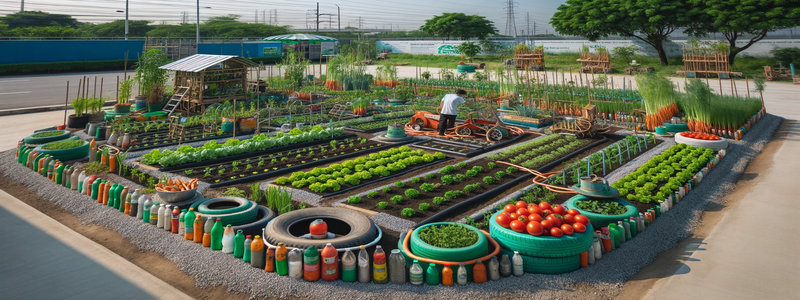

# Trash Post Dashboard: Life Trends of Second-Hand Goods

## Project Overview
This project asynchronously retrieves data from [Trash Nothing](https://trashnothing.com/beta/browse?r=logo) API then leverages Python's dataclass
to process and store the data in a CSV file. Once the data is saved, the application loads the data and performs additional processing. The 
application then generates a dashboard that provides both numerical and text analyses.

TrashPost is a website in which people offer second-hand goods to others, predominantly for free. A post includes a title, description, day/time available for pickup, location, and more. A post also includes whether the item was picked up.

## Dashboard Samples

Here are a few sample visualizations from the Trash Nothing dashboard.

In the below word cloud, we see the words that are most used in the post descriptions. Understandably, the primary words correspond to (1) coordination/exchange guidelines, e.g., policy, offer, pick up, and (2) general product descriptions, e.g., good condition, old, and size.

<p align="center">
    
</p>


The below count plot shows the number of items that are still available or have been promised to an individual. This visualization is misleading because it does not show the items that were taken. Once an item is taken, the users remove it from the site.


<p align="center">
    
</p>


Another interesting observation is how long do people make their items available pickup. We nearly see a binomial distribution with the apexes at 10 - 20 days and 80 - 90 days. We are unsure of the default settings. The 3 month duration may be caused by default bias.


<p align="center">
    
</p>


## Project Structure

```
TRASH_NOTHING/
│
├── data/  # hidden from GitHub. demonstrates where data is stored.
│ └── trash_posts.csv
│
├── img/
│ ├── days_available.png
│ ├── garden.png
│ ├── interest.png
│ ├── outcome.png
│ ├── recycle.png
│ └── wordcloud.png
│
├── src/
│ ├── init.py
│ ├── api.py
│ ├── app.py
│ ├── config.py
│ ├── data_processing.py
│ ├── models.py
│ └── visualization.py
│
├── tests/
│ ├── init.py
│ ├── conftest.py
│ ├── test_api.py
│ ├── test_data_processing.py
│ └── test_models.py
│
├── .gitignore
├── LICENSE
├── project.toml
├── README.md
├── requirements.txt
└── LICENSE

```
### Explanation

- `data/`: Contains CSV files used for data processing.
- `img/`: Holds images used in the project for documentation or analysis.
- `src/`: Source code including the main application and utility modules.
- `tests/`: Contains unit tests for testing the source code.
- `world-pop-env/`: Python virtual environment for managing dependencies.

## Packages
- pandas
- streamlit
- aiohttp
- plotly.express
- wordcloud
- matplotlib
- pytest
- pytest-asyncio
- pytest-mock
- pytest-aiohttp
- black
- isort
- python-dotenv
- setuptools
- flake8
